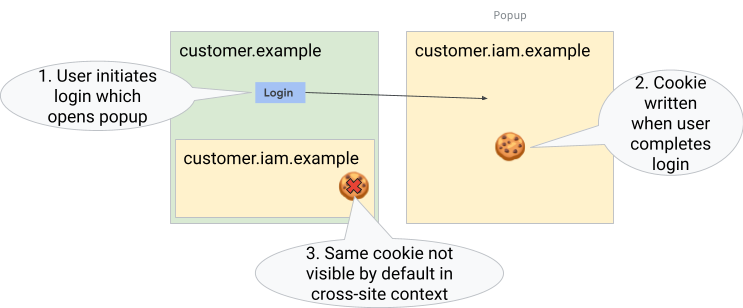
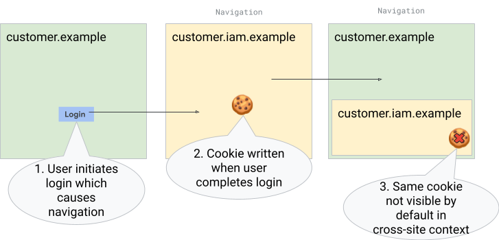
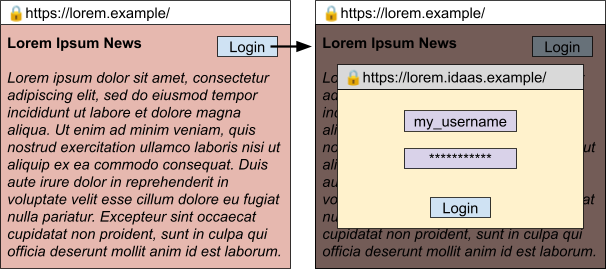
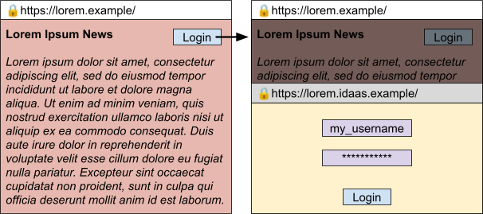

# Explainer: Partitioned Popins

* [Discussion](https://github.com/arichiv/partitioned-popins/issues)

## Introduction

A new web primitive is needed to cover short-lived popup use cases which require access to storage partitioned by the popup opener.
This primitive should be private and secure by default, while providing a consistent UI experience across user agents.

To solve this need, we propose the “Partitioned Popin”, a type of pop-up for loading web content with two unique new features: a modal-like UI relative to its opener tab and cookies/storage being partitioned to its opener context.

This ‘popin’ could be useful for any sites wanting a consistent way to prompt the user to interact with a new window in a way that makes it clear what site initiated the interaction.
Making the ‘popin’ partitioned by its opener ensures the privacy of an iframe (restricting access to first-party storage) while retaining the security of a top-level navigation (isolating the process).

## Motivation

Many smaller businesses and applications on the web currently use third-party vendors to perform or facilitate security sensitive operations such as authentication.
These third-party vendors prefer to be loaded in top-level contexts so that they are not subject to clickjacking or script injection attacks by a compromised relying party.
To obtain this behavior, login vendors typically open popups or perform redirects, which subsequently close or redirect back to the relying party, with a result token sent back via mechanisms such as cookies, postMessage, or URL parameters.

These methods are incompatible with modern browsers’ privacy and security goals for partitioning cross-site state:

* Third-party cookies are on the path to being deprecated in all major browsers, breaking any flows that would require the service to access them on the relying party’s site.
* Opener access to unpartitioned cross-site contexts provides a potential tracking vector, and browser vendors have [discussed options to restrict default opener access](https://github.com/privacycg/proposals/issues/7) in the past.
* Websites that require [crossOriginIsolation](https://developer.mozilla.org/en-US/docs/Web/API/crossOriginIsolated) [cannot currently](https://github.com/explainers-by-googlers/document-isolation-policy) open popups without severing the opener relationship, which may be required for the login (or other transaction) to complete.
* Using URL parameters for sensitive information makes sites more vulnerable to cross-site request forgery attacks.

There are also some UX challenges with this pattern:
* Popups on mobile open in new tabs, and bring users outside of the context of the main application (relying party) that they are interacting with. As a result, most vendors rely on redirects on mobile, which offer a suboptimal user experience.
* Even popups on desktop can be challenging for developers to correctly position the window and gray out the relying party, to ensure that users can easily locate the window and complete the operation.

### Examples

In the example below, popup authentication is blocked by third-party cookie deprecation.



In the example below, redirect authentication is blocked by third-party cookie deprecation.



These flows are currently partly detected and mitigated through the [cookie access heuristics](https://github.com/amaliev/3pcd-exemption-heuristics/blob/main/explainer.md) that shipped in major browsers.
The general consensus is that the web ecosystem needs to find ways to replace the heuristics with more private and secure alternatives.
We see this proposal as a major contribution to that effort.

## Prior Work

Existing work on the [restrict-properties](https://groups.google.com/a/chromium.org/g/blink-dev/c/JBTWXSHE8M0/) proposal (allowing popups without breaking [crossOriginIsolation](https://developer.mozilla.org/en-US/docs/Web/API/crossOriginIsolated)) ran into feedback from developers who needed a way to focus the opened window (postMessage and closed were not sufficient).

Investigations into [protecting openers](https://groups.google.com/a/chromium.org/g/blink-dev/c/RiNkhQGvmkc/m/jP93p7VLBwAJ) revealed the amount of use in the wild that would have to adapt to such a paradigm, and the need for some underlying improvement in functionality to make the prospect more attractive to developers.

## Goals

* Support common short-lived partitioned popup use cases like login that can/should interrupt other activity on some top-level browsing context.
* Be secure-by-default (non-impacting to [crossOriginIsolation](https://developer.mozilla.org/en-US/docs/Web/API/crossOriginIsolated)).
* Ensure the API is forward compatible with potential future needs to add support for unpartitioned popins or popins with a full opener.

## Non-Goals

* Address all popup (or window.opener) based use-cases.
* Address single-sign-on (SSO) or federated login use cases. To preserve a good user experience and security, one-to-many login scenarios should use FedCM instead.
* Retain comprehensive cross-window access/management via window.opener.
* Implement unpartitioned popins.

## Use Cases

* [IDaaS needs a popup to have the same partition as iframe for authentication.](https://github.com/privacycg/CHIPS/issues/80)
  * To provide login for vanity domains authentication information is passed back from the login popup via embedded iframe. Before third-party cookie deprecation, it was possible for the login iframe to read cookies set by the login popup. As there’s a 1:1 relationship between the origin of the login service and website there’s no disadvantage to having the popup be partitioned (no SSO-like ability is lost).
* [Embedded enterprise software needs to open pop-ups for some features.](https://github.com/privacycg/CHIPS/issues/82)
  * When an embedded web application opens a popup for some feature to work, this popup has no access to cookies/storage from the embedded opener context and defaults to being logged out. Before storage partitioning and third-party cookie deprecation, the popup had access to the same authentication information the third-party context did.

## Proposed Solutions

### JavaScript

#### Creation

The following would be added to [windowFeatures](https://developer.mozilla.org/en-US/docs/Web/API/Window/open#windowfeatures):

* popin - Indicates the window should be opened as an inline popin. The target must be `_blank` as others have no special meaning in this context. Cannot be used with `popup` feature as these options conflict. The features `width`, `height`, `left`, and `top` may or may not be respected by the rendering browser (especially on mobile). `noopener` and `noreferrer` will be respected as usual.

A draft API shape for partitioned popins would look like:

```
let popin_handle = window.open('https://example.com', '_blank', 'popin');
```

Only one popin at a time can be active in a given window.
If there is an active popin then calls to window.open to trigger further popins will fail.

Opener access is available to popins by default, but is restricted to the `postMessage` and `closed` properties, to give the same security benefits as the proposed [restrict-properties](https://developer.chrome.com/blog/coop-restrict-properties) COOP header (note: [plans in this area are changing rapidly](https://github.com/explainers-by-googlers/document-isolation-policy)).
Opener access can be fully severed by passing the `noopener` feature, COOP headers, and other existing methods.
There is no way to gain opener access to functions/members beyond `postMessage` and `closed`.

In the opened popin context, `closed` would always return false as the popin can only exist in a window while the window is open.

Within the popin context, `window.open` cannot be used to open a nested popin.
`window.open` (as well as HTML links) can be used to open new popups or tabs, but no opener will be connected to these contexts.
`window.location.assign` (as well as HTTP/HTML redirects) can be used to navigate the popin itself.

This API is only available in secure contexts and can only open secure contexts.
Attempting to navigate/redirect a popin to an insecure context will fail.

User interaction is required to open the popin.
Without user interaction the popin will be blocked and an error will be thrown when calling `window.open`.
This is important to prevent short-lived popins from being opened and immediately grabbing auto-fill information to nearly-silently complete login without user consent.

#### Interaction with Cookies and Storage

When a popin is opened by a browsing context, it inherits the storage partition key that an iframe opened in that context would have.
If top-level site A opens popin A, then the popin will be unpartitioned.
If top-level site A opens popin B, the popin will be partitioned.
If top-level site A embeds iframe B and that iframe opens popin A, the popin would be partitioned using the ancestor chain bit.

Like a cross-site iframe, a Partitioned Popin will reject any cookies unless they are marked with the `Partitioned` and `SameSite=None` attributes.
The cookie partition key will also be based on the context that opened the popin.

#### Detection

To allow developers to gracefully fall back to navigation-based or iframe-based flows when Partitioned Popins are not supported by the platform, it could be useful to expose this information to them at runtime.
Similarly, it seems useful for developers to understand when their documents are loaded in a popin context, to adjust the loaded content accordingly.

To support potential future types of popins we should use an enum rather than a boolean value in feature detection paths.

```
enum PopinContextType { "partitioned" };
```

A draft API for feature detection by a prospective popin opener could look like:
```
interface Navigator {
  // Returns an empty array if no popin context types are supported.
  Array<PopinContextType> popinContextTypesSupported();
};
```

A draft API for a popin to detect it is a popin could look like:
```
interface Navigator {
  // Returns null if this isn't a popin context.
  PopinContextType? popinContextType();
};
```

### HTTP

#### Request Header

All pages navigated to inside a partitioned popin must send an HTTP request header indicating this. The proposed header’s value would be an sf-token one possible token supported (‘partitioned’) potentially expandable in future.

```
Sec-Popin-Context: partitioned
```

This header should be omitted when the request is not for a popin context.

#### Response Header

All pages navigated to inside a partitioned popin must return an HTTP response header indicating their support for the partitioned popin context.
The proposed header’s value would work similar to a [permissions policy](https://developer.mozilla.org/en-US/docs/Web/HTTP/Headers/Permissions-Policy) (an sf-dictionary) with one possible permission (partitioned) potentially expandable in future.

```
Popin-Policy: partitioned=()
Popin-Policy: partitioned=*
Popin-Policy: partitioned=("https://demo.example/")
```

`partitioned=()` is the default value and disallows the page from ever being opened in a partitioned popin context.

`partitioned=*` allows the page to be loaded in a partitioned popin context by any page.

`partitioned=("https://demo.example/")` allows the page to be loaded in a partitioned popin context by a top-level frame on https://demo.example/ specifically.

Navigating to or redirecting through a page without a `Popin-Policy` that permits the opening context to do so will cause the popin to automatically close the popin and report the error to the opening context.

This header is important to ensure that, where partitioned popins are used for authentication and other sensitive tasks, the pages engaging in these sensitive tasks affirmatively consent to the popin context. This prevents unexpectedly authenticated iframe contexts from breaking assumptions sites have made about their security model.

#### Permissions Policy

A new policy directive, `popin`, will be added to control which frames can open partitioned popins. This directive will have a default value of `self` (not `*` as many directives do) to ensure that without affirmative action, cross-site iframes will not be able to open popins.

### UX

Draft UX (not final) for large-screen/desktop could look like:



Draft UX (not final) for small-screen/mobile could look like:



Please note that we recommend the UX has the following properties:
* While the opener’s address bar (on https://lorem.example/) is always editable, the popin’s address bar (on https://lorem.idaas.example/) is not editable by the user but remains visible as an indicator of what page was loaded.
* The content of the opener should be grayed out and non-interactive (receive no click/touch/etc events, although JavaScript execution will continue) until the popin is closed. This is somewhat similar to the modal option for HTMLDialogueElement, though the dialogue itself is a new window and not a DOM overlay. If the opener is clicked while a popin is open, the popin should be foregrounded.
* If the user switches tabs or windows the popin is not dismissed, but disappears to be re-displayed to the user if/when they switch back to that opening tab/window. If the opener is closed, the popin is automatically dismissed.
Spoofability should be limited by making this more like a system-window/dialogue that cannot be simulated by an iframe with special stylings.

### Open Questions

* How do Partitioned Popins interact with permission delegation and iframe-based permission policies?
* How do Partitioned Popins interact with Storage Access API requests and active Storage Access permissions?
* Should autofill information be keyed on opener+popin-origin to prevent autofill based on popin-origin alone?

## Alternatives Considered

### [Storage Access API (SAA)](https://privacycg.github.io/storage-access/)

SAA provides a way for the cross-site iframe to complete authentication by requesting access to the same unpartitioned storage that the popup/redirect just wrote.
Unfortunately, this access requires user interaction with the iframe, preventing silent token acquisition.
Further, this API was not intended to be used for login so the wording in the permission prompt the user sees when access is attempted may confuse them.

### [Federated Credential Management (FedCM)](https://fedidcg.github.io/FedCM/)

IDaaS providers are different from federated identity providers, in that user identity is scoped/partitioned to the website that the user is visiting.
FedCM is targeted to the latter use case so is not a good fit in terms of user prompt language and adoption cost.
For example, an enterprise single-sign-on (SSO) solution doesn’t want user identities partitioned by service, it wants a single user identity which provides access to multiple services.
For this reason solutions like [FedCM+SAA](https://github.com/explainers-by-googlers/storage-access-for-fedcm) also would not work.

### [Exemption Heuristics](https://github.com/amaliev/3pcd-exemption-heuristics/blob/main/explainer.md)

This provides an automated way for some login-like flows to automatically grant access to unpartitioned storage in third-party contexts.
This has the downside of providing access to unpartitioned storage in a partitioned context rather than requiring all storage remain partitioned.
Additionally, these heuristics may be deprecated and require interaction.

## Privacy & Security Considerations

### Reducing the effectiveness of SSO on the web

As explained, we expect a major use case of partitioned popins to be cross-site login.
The proposal primarily wants to address logging into 3rd party vendors that need to integrate with a single top-level site in a 1:1 relationship.
However, specifically in enterprise or federated identity scenarios, users may want to integrate with the same 3rd party service for single-sign-on (SSO) or other 1:many purposes.
Partitioned popins are not very effective at addressing that use case, because they’re partitioned.
They don’t carry over state from the 3rd party vendor, thus requiring the user to log into the top-level site again and again, effectively rendering the single-sign-on functionality moot.
In addition to increasing user friction, this has two potentially harmful consequences from a security perspective:

* It trains the user to manually enter passwords (or, ideally, use a password manager) in more contexts.
* It reduces the ability of login services to use cookies for security purposes, e.g. by massively increasing the number of times a user signs in “from a new device”.

To counteract this risk, browsers that implement Partitioned Popins should offer a range of additional API options that make it easy for developers to implement SSO / federated login, such as FedCM, Passkeys or the Storage Access API.
We believe that the increased user friction from partitioning will lead most developers to choose the most secure user experience if good alternatives are available.

### Platform feature interaction

The assumption behind security and privacy review of storage partitioning and third-party cookie deprecation has been that authentication should be performed in a top-level frame which has access to unpartitioned storage.
The partitioned popin model breaks this assumption by providing a top-level frame that has partitioned storage.
Compatibility between this and many existing web features will have to be considered to ensure we aren’t opening up an avenue for abuse.

### Aggregator Tracking

If we allow partitioning of any links opened by some top-level site this could enable cross-site tracking by unifying the cookie buckets of iframes in the opened popins.
For example, if a top-frame on origin A (storage key: <A,A,SameSite>) opens a partitioned popins on origin B (storage key: <A,B,CrossSite>) and later one on origin C (storage key: <A,B,CrossSite>) and each popup embeds an iframe for origin A (storage key: <A,A,CrossSite>), these iframes share the same cookies/storage.
This could enable a publisher with many outbound links to share ad-network cookies across any links opened in partitioned popins.
This could be mitigated by a heuristic (prompting the user if more than one popin is opened per-navigation) or by prompting the user if a partitioned popin is to be opened.

### Popin Spam

The risk of popin spam is lower than popup spam as only one can be active at a time and user interaction with browser UX is not preempted (popins live within the owning window and the user can always close the tab/window or switch to a different tab/window).
If needed further heuristics could be applied to rate limit popins or require user permission to open them.

### COOP and Cross-Origin Isolation

Although `postMessage` and `closed` would be available via the window proxy by default, it should remain possible to further restrict popin access via existing means.
For websites already using [COOP `same-origin` or `same-origin-allow-popups` options](https://web.dev/articles/why-coop-coep), in cases where the opener would be severed they should remain as such.
No path to enabling more window proxy access to popins should be added.

## UX Considerations

### Novelty

This is a new web UX primitive and significant thought should go into design and delivery. Picking one platform (e.g., mobile) first for testing to get the implementation right may be preferable.

### Accessibility

This new surface should remain legible to screen readers and other common browser tools.
The ability to close the popin is especially important to communicate to users who would have difficulty intuiting they could interact with the negative space around the popin.

### Use for long-lived documents

Popins are intended to be for short-term interactions that do not require user access to the initiator before resolution.
What about [use cases](https://issuetracker.google.com/317188859) not covered by this (e.g., an iframed web app opening a popup to display information the user wants to compare against the opening iframe)?
Can we provide the user with a way to ‘pop out’ the popin?
How do we differentiate between the partitioned and unpartitioned top-level windows?

### Link Preview

It’s possible to get a popin-like UX on Chrome for Android or in Safari as part of the link-preview feature.
These previews have different privacy and security implications than popins as they are unpartitioned, ephemeral/non-interactive while previewed, and resolve as new tabs.
We should ensure the user isn’t confused between the two UX modes.

## Future Work

If we think forward to a time when popins have been shipped and adoption is significant, deprecating the riskiest parts of current popup and `window.opener` behavior should be considered.
Should we launch unpartitioned popins as well?
Can the desktop-specific popup UI be removed?
Can we require all openers be severed or limited/defaulted to just `postMessage` and `closed`?
If purpose built APIs (e.g., FedCM) have been delivered and widely adopted, these things may be within our reach, since it eliminates backwards-compatibility risks for use cases like login.
